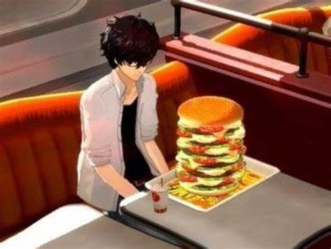

<h1 align="center"> Big Bang Burger Website Project </h1> 

Website inspired by Okumura Foods - Big Bang Burger - from <a href="https://www.atlus.com/persona5/home.html">Persona 5 </a>

  
  <a href="#-screenshots">Screenshots</a>&nbsp;&nbsp;&nbsp;|&nbsp;&nbsp;&nbsp;
  <a href="#-technologies">Technologies</a>&nbsp;&nbsp;&nbsp;|&nbsp;&nbsp;&nbsp;
  <a href="#-features">Features</a>&nbsp;&nbsp;&nbsp;|&nbsp;&nbsp;&nbsp;
  <a href="#-project">Project</a>&nbsp;&nbsp;&nbsp;|&nbsp;&nbsp;&nbsp;
  <a href="#-license">License</a>  

 

  

## 📸 Screenshots

 

  

 

## 🛠 Technologies

- HTML e CSS
- Git e GitHub

 

## ✨ Features

- Menu with checkbox;
- Page Integration
  
 

## 💻 Project

- The website was created to practice HTML and CSS.

 

## 📜 License

* This project is licensed under the [MIT License](https://choosealicense.com/licenses/mit/)

 

## 🫱🏻‍🫲🏻 Contributing

 Contributions, issues, and feature requests are welcome! Please, feel free to do it! 😉 

 

## 🌟 Support

 If you like this project, please give it a star ⭐ and share it with others! 😄 

